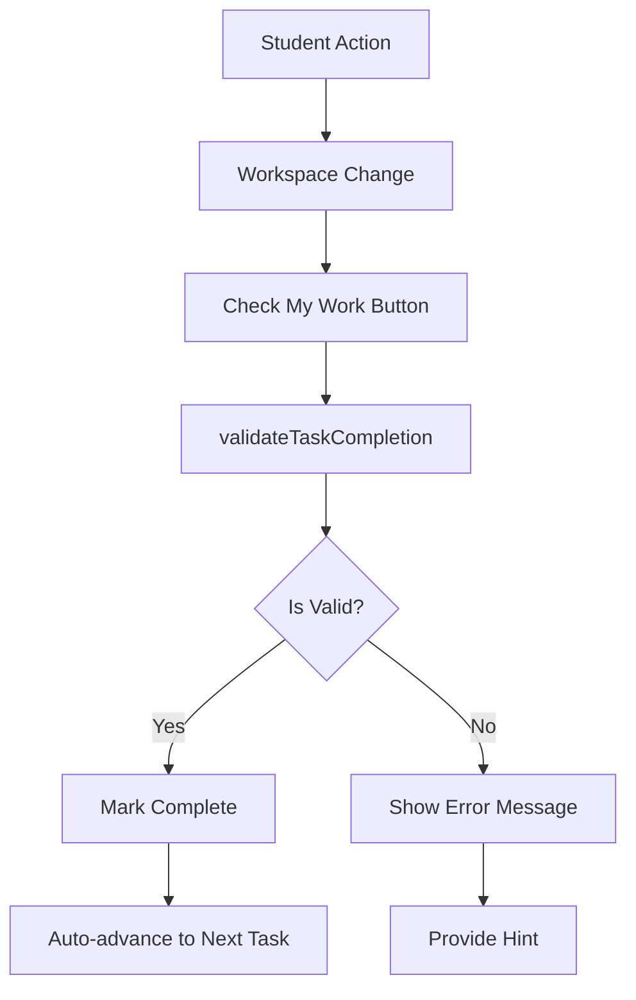

# Guide Technique - Implémentation du Système de Validation Blockly

## 🔧 Implémentation Détaillée

### 1. Architecture de Validation

#### Flux de Données


#### Classes et Fonctions Principales
```javascript
// Structure des fonctions de validation
├── validateLesson(workspace, lesson)
├── validateBlockSequence(topBlocks, expectedBlock)
├── validateBlockChain(actualBlock, expectedBlock)
├── validateTaskCompletion(workspace, task)
├── getHint(workspace, task)
└── validateCompleteSequence(workspace)
```

### 2. Algorithmes de Validation

#### A. Validation par Présence de Blocs
```javascript
const validateBlockPresence = (workspace, requiredBlockType) => {
  const allBlocks = workspace.getAllBlocks();
  const hasRequiredBlock = allBlocks.some(block => block.type === requiredBlockType);
  
  return {
    isValid: hasRequiredBlock,
    message: hasRequiredBlock 
      ? `✅ Bloc ${requiredBlockType} trouvé!`
      : `❌ Bloc ${requiredBlockType} manquant`
  };
};
```

#### B. Validation par Connexion de Blocs
```javascript
const validateBlockConnection = (workspace, parentType, childType) => {
  const allBlocks = workspace.getAllBlocks();
  const parentBlock = allBlocks.find(block => block.type === parentType);
  
  if (!parentBlock) {
    return { isValid: false, message: `Bloc parent ${parentType} manquant` };
  }
  
  const nextBlock = parentBlock.getNextBlock();
  const isConnected = nextBlock && nextBlock.type === childType;
  
  return {
    isValid: isConnected,
    message: isConnected 
      ? '✅ Blocs correctement connectés!'
      : '❌ Connectez les blocs en les rapprochant'
  };
};
```

#### C. Validation par Valeurs de Champs
```javascript
const validateFieldValues = (workspace, blockType, expectedFields) => {
  const allBlocks = workspace.getAllBlocks();
  const targetBlock = allBlocks.find(block => block.type === blockType);
  
  if (!targetBlock) {
    return { isValid: false, message: `Bloc ${blockType} non trouvé` };
  }
  
  for (const [fieldName, expectedValue] of Object.entries(expectedFields)) {
    const actualValue = targetBlock.getFieldValue(fieldName);
    if (actualValue != expectedValue) {
      return {
        isValid: false,
        message: `❌ ${fieldName} devrait être ${expectedValue}, mais c'est ${actualValue}`
      };
    }
  }
  
  return { isValid: true, message: '✅ Valeurs des champs correctes!' };
};
```

### 3. Patterns de Validation Avancés

#### A. Validation de Séquence Récursive
```javascript
const validateRecursiveSequence = (currentBlock, expectedSequence, index = 0) => {
  // Cas de base : fin de séquence
  if (index >= expectedSequence.length) {
    return { isValid: true, message: '✅ Séquence complète validée!' };
  }
  
  const expectedBlock = expectedSequence[index];
  
  // Vérifier le type de bloc actuel
  if (!currentBlock || currentBlock.type !== expectedBlock.type) {
    return {
      isValid: false,
      message: `❌ Attendu ${expectedBlock.type}, trouvé ${currentBlock?.type || 'rien'}`
    };
  }
  
  // Vérifier les champs si spécifiés
  if (expectedBlock.fields) {
    const fieldValidation = validateFieldValues(
      { getAllBlocks: () => [currentBlock] }, 
      currentBlock.type, 
      expectedBlock.fields
    );
    if (!fieldValidation.isValid) {
      return fieldValidation;
    }
  }
  
  // Récursion sur le bloc suivant
  const nextBlock = currentBlock.getNextBlock();
  return validateRecursiveSequence(nextBlock, expectedSequence, index + 1);
};
```

#### B. Validation de Structure de Boucle
```javascript
const validateLoopStructure = (workspace, loopType, expectedInnerBlocks) => {
  const allBlocks = workspace.getAllBlocks();
  const loopBlock = allBlocks.find(block => block.type === loopType);
  
  if (!loopBlock) {
    return { isValid: false, message: `❌ Boucle ${loopType} manquante` };
  }
  
  // Récupérer les blocs à l'intérieur de la boucle
  const innerBlocks = [];
  const firstInnerBlock = loopBlock.getInputTargetBlock('SUBSTACK');
  
  let currentInner = firstInnerBlock;
  while (currentInner) {
    innerBlocks.push(currentInner);
    currentInner = currentInner.getNextBlock();
  }
  
  // Valider la présence des blocs attendus à l'intérieur
  for (const expectedBlock of expectedInnerBlocks) {
    const found = innerBlocks.some(block => block.type === expectedBlock.type);
    if (!found) {
      return {
        isValid: false,
        message: `❌ Bloc ${expectedBlock.type} manquant dans la boucle`
      };
    }
  }
  
  return { isValid: true, message: '✅ Structure de boucle correcte!' };
};
```

### 4. Système de Hints Intelligent

#### A. Analyse Contextuelle
```javascript
const analyzeWorkspaceContext = (workspace, currentTask) => {
  const allBlocks = workspace.getAllBlocks();
  const blockTypes = allBlocks.map(block => block.type);
  
  const context = {
    totalBlocks: allBlocks.length,
    blockTypes: blockTypes,
    hasEventBlock: blockTypes.includes('event_whenflagclicked'),
    topBlocks: workspace.getTopBlocks(true),
    disconnectedBlocks: allBlocks.filter(block => !block.getParent() && !block.previousConnection?.isConnected())
  };
  
  return context;
};
```

#### B. Génération de Hints Adaptifs
```javascript
const generateAdaptiveHint = (context, currentTask) => {
  const { blockTypes, disconnectedBlocks, hasEventBlock } = context;
  
  // Hints basés sur l'état actuel
  if (blockTypes.length === 0) {
    return {
      type: 'getting-started',
      message: "🚀 Commencez par glisser un bloc de la boîte à outils!",
      priority: 'high'
    };
  }
  
  if (disconnectedBlocks.length > 1) {
    return {
      type: 'connection',
      message: "🔗 Vous avez des blocs séparés. Essayez de les connecter!",
      priority: 'medium'
    };
  }
  
  if (!hasEventBlock && currentTask.blockType !== 'event_whenflagclicked') {
    return {
      type: 'prerequisite',
      message: "⚡ N'oubliez pas de commencer avec un bloc d'événement!",
      priority: 'high'
    };
  }
  
  // Hints spécifiques à la tâche
  return getTaskSpecificHint(currentTask, context);
};
```

### 5. Validation Multi-Niveaux

#### A. Niveaux de Validation
```javascript
const ValidationLevels = {
  BASIC: 'basic',         // Présence de blocs
  INTERMEDIATE: 'intermediate',  // Connexions correctes
  ADVANCED: 'advanced',   // Logique et valeurs
  EXPERT: 'expert'        // Performance et optimisation
};

const validateByLevel = (workspace, task, level = ValidationLevels.BASIC) => {
  switch (level) {
    case ValidationLevels.BASIC:
      return validateBasicRequirements(workspace, task);
    
    case ValidationLevels.INTERMEDIATE:
      return validateConnections(workspace, task);
    
    case ValidationLevels.ADVANCED:
      return validateLogicAndValues(workspace, task);
    
    case ValidationLevels.EXPERT:
      return validateOptimization(workspace, task);
    
    default:
      return validateBasicRequirements(workspace, task);
  }
};
```

#### B. Validation Progressive
```javascript
const validateProgressive = (workspace, task) => {
  const results = [];
  
  // Test chaque niveau progressivement
  for (const level of Object.values(ValidationLevels)) {
    const result = validateByLevel(workspace, task, level);
    results.push({ level, ...result });
    
    // S'arrêter au premier échec
    if (!result.isValid) {
      break;
    }
  }
  
  const highestLevel = results[results.length - 1];
  const passedLevels = results.filter(r => r.isValid).length;
  
  return {
    ...highestLevel,
    progress: passedLevels / Object.keys(ValidationLevels).length,
    levelsPassed: passedLevels,
    totalLevels: Object.keys(ValidationLevels).length
  };
};
```

### 6. Validation en Temps Réel

#### A. Debounced Validation
```javascript
import { debounce } from 'lodash';

const createRealtimeValidator = (workspace, onValidation) => {
  const debouncedValidate = debounce((currentTask) => {
    const validation = validateTaskCompletion(workspace, currentTask);
    onValidation(validation);
  }, 300);
  
  // Écouter les changements du workspace
  workspace.addChangeListener((event) => {
    if (event.type === Blockly.Events.BLOCK_MOVE || 
        event.type === Blockly.Events.BLOCK_CREATE ||
        event.type === Blockly.Events.BLOCK_DELETE) {
      debouncedValidate(getCurrentTask());
    }
  });
  
  return debouncedValidate;
};
```

#### B. Validation State Machine
```javascript
const ValidationStates = {
  IDLE: 'idle',
  VALIDATING: 'validating',
  SUCCESS: 'success',
  ERROR: 'error',
  HINT: 'hint'
};

class ValidationStateMachine {
  constructor() {
    this.state = ValidationStates.IDLE;
    this.listeners = [];
  }
  
  transition(newState, data = {}) {
    const oldState = this.state;
    this.state = newState;
    
    this.listeners.forEach(listener => 
      listener({ oldState, newState, data })
    );
  }
  
  validate(workspace, task) {
    this.transition(ValidationStates.VALIDATING);
    
    setTimeout(() => {
      const result = validateTaskCompletion(workspace, task);
      
      if (result.isValid) {
        this.transition(ValidationStates.SUCCESS, result);
      } else {
        this.transition(ValidationStates.ERROR, result);
        
        // Génér automatiquement un hint après erreur
        setTimeout(() => {
          const hint = getHint(workspace, task);
          this.transition(ValidationStates.HINT, { hint });
        }, 1000);
      }
    }, 100);
  }
}
```

### 7. Métriques de Performance

#### A. Collecte de Métriques
```javascript
class ValidationMetrics {
  constructor() {
    this.metrics = {
      totalValidations: 0,
      successfulValidations: 0,
      failedValidations: 0,
      averageValidationTime: 0,
      mostCommonErrors: {},
      hintUsage: {}
    };
  }
  
  recordValidation(task, result, duration) {
    this.metrics.totalValidations++;
    
    if (result.isValid) {
      this.metrics.successfulValidations++;
    } else {
      this.metrics.failedValidations++;
      this.recordError(task.blockType, result.message);
    }
    
    this.updateAverageTime(duration);
  }
  
  recordError(blockType, message) {
    const key = `${blockType}:${message}`;
    this.metrics.mostCommonErrors[key] = 
      (this.metrics.mostCommonErrors[key] || 0) + 1;
  }
  
  getSuccessRate() {
    return this.metrics.successfulValidations / this.metrics.totalValidations;
  }
}
```

#### B. Analytics Dashboard Data
```javascript
const generateAnalytics = (metrics) => {
  return {
    overview: {
      totalValidations: metrics.totalValidations,
      successRate: metrics.getSuccessRate(),
      averageTime: metrics.averageValidationTime
    },
    errors: {
      mostCommon: Object.entries(metrics.mostCommonErrors)
        .sort(([,a], [,b]) => b - a)
        .slice(0, 10),
      byBlockType: groupErrorsByBlockType(metrics.mostCommonErrors)
    },
    hints: {
      mostRequested: Object.entries(metrics.hintUsage)
        .sort(([,a], [,b]) => b - a)
        .slice(0, 10)
    }
  };
};
```

### 8. Tests Unitaires pour la Validation

#### A. Tests de Base
```javascript
describe('Validation System', () => {
  let mockWorkspace;
  
  beforeEach(() => {
    mockWorkspace = createMockWorkspace();
  });
  
  test('should validate event block presence', () => {
    // Arrange
    mockWorkspace.addBlock('event_whenflagclicked');
    const task = { blockType: 'event_whenflagclicked' };
    
    // Act
    const result = validateTaskCompletion(mockWorkspace, task);
    
    // Assert
    expect(result.isValid).toBe(true);
    expect(result.message).toContain('Great!');
  });
  
  test('should detect missing event block', () => {
    // Arrange
    const task = { blockType: 'event_whenflagclicked' };
    
    // Act
    const result = validateTaskCompletion(mockWorkspace, task);
    
    // Assert
    expect(result.isValid).toBe(false);
    expect(result.message).toContain('Add the');
  });
});
```

#### B. Tests d'Intégration
```javascript
describe('Integration Tests', () => {
  test('should validate complete lesson sequence', async () => {
    const workspace = createRealWorkspace();
    const lesson = getLessonById(1);
    
    // Simulate student actions
    await simulateStudentProgress(workspace, lesson);
    
    // Validate final state
    const result = validateLesson(workspace, lesson);
    expect(result.isValid).toBe(true);
  });
});
```

### 9. Configuration et Extensibilité

#### A. Configuration des Règles de Validation
```javascript
const validationConfig = {
  strict: false,          // Mode strict vs permissif
  autoHints: true,        // Hints automatiques après erreur
  realtime: true,         // Validation en temps réel
  progressiveValidation: true,  // Validation par niveaux
  customRules: []         // Règles personnalisées
};

const configureValidation = (config) => {
  Object.assign(validationConfig, config);
};
```

#### B. Plugin System
```javascript
class ValidationPlugin {
  constructor(name, validator) {
    this.name = name;
    this.validator = validator;
  }
  
  validate(workspace, task) {
    return this.validator(workspace, task);
  }
}

const validationPlugins = new Map();

const registerValidationPlugin = (plugin) => {
  validationPlugins.set(plugin.name, plugin);
};

const validateWithPlugins = (workspace, task) => {
  for (const plugin of validationPlugins.values()) {
    const result = plugin.validate(workspace, task);
    if (!result.isValid) {
      return result;
    }
  }
  
  return { isValid: true, message: 'All plugins passed!' };
};
```

Ce système de validation forme une infrastructure robuste et extensible qui soutient l'apprentissage progressif tout en fournissant des feedbacks constructifs et adaptatifs aux étudiants.
